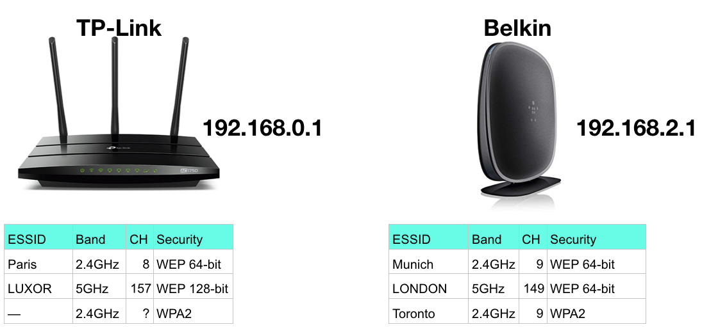

# Mini-WiFi-Village

Welcome to the Mini WiFi village (inspired by https://wctf.us). This exercise writeup was made with a classroom setting in mind. This is, it can be setup at an academic institution to allow students have a hands-on experience with attacking/cracking WEP and WPA2 access points.

Please setup the lab environment as directed in the ```Setup Directions``` sections.
Type the commands yourself.
Copy and paste will not work properly.
If you run into trouble or have questions, feel free to e-mail Ahmed Ibrahim at (a.i@virginia.edu) for assistance.

---

## Table of Content

<ol start="0">
	<li><a href="#RequiredEquipment">Required Equipment</a></li>
	<li><a href="#Networks Setup Directions">Networks Setup Directions</a></li>
	<li><a href="#RPis Setup Directions">Raspberry Pis (RPis) Setup Directions</a></li>
	<li><a href="#bssid">Gathering bssid information</a></li>
	<li><a href="#cracking">Cracking these networks</a></li>
</ol>

---

<a name="RequiredEquipment"></a>
### 0. Required Equipment

To build the lab environment, you need the following equipment:

- One Belkin N450 F9K1105V4 (The [V4](./images/belkin-bottom.jpg) is guaranteed to work but is currently out-of-stock - find it on eBay)
- One [TP-Link AC1750 (Archer A7)](https://www.amazon.com/gp/product/B079JD7F7G/ref=ppx_yo_dt_b_asin_title_o07__o00_s00)
- Three [CanaKit Raspberry Pi 3](https://www.amazon.com/CanaKit-Raspberry-Premium-Clear-Supply/dp/B07BC7BMHY/ref=pd_ybh_a_10?_encoding=UTF8&psc=1&refRID=7WDD1BYXQ8EA6P5M6NNK)
- Three [Samsung 32GB MicroSD Memory Card](https://www.amazon.com/Samsung-MicroSD-Adapter-MB-ME32GA-AM/dp/B06XWN9Q99/ref=pd_bxgy_236_2?_encoding=UTF8&pd_rd_i=B06XWN9Q99&pd_rd_r=fdab07ed-106b-11e9-af29-9f1ba580f978&pd_rd_w=RIzg8&pd_rd_wg=5gnwN&pf_rd_p=6725dbd6-9917-451d-beba-16af7874e407&pf)

At the time of creating this document, the cost for the abovementioned equipment is as follows:

| Device | Unit Price | Quantity | Total Price |
| -- | -- | -- | -- |
| Belkin N450 F9K1105v4 | ~$20 | 1 | $20 |
| TP-Link AC1750 (Archer A7) | $59.99 | 1 | $59.99 |
| CanaKit Raspberry Pi 3 | $54.99 | 3 | $164.97 |
| Samsung 32GB MicroSD Memory Card | $7.99 | 3 | $23.97 |
| TOTAL |  |  | $268.93 |


To perform the attack, you need the following external wireless adapter:

- [Panda N600 Dual Band (2.4GHz and 5.0GHz) 300Mbps Wireless N USB Adapter](https://www.amazon.com/gp/product/B00U2SIS0O/ref=ppx_yo_dt_b_asin_title_o02__o00_s00?ie=UTF8&psc=1) ($24.99 a piece)

---

<a name="Networks Setup Directions"></a>
### 1. Networks Setup Directions

The Belkin N450 router will broadcast the following networks:

| AP Name | Band | Channel | Security | Key | Notes |
| -- | -- | -- | -- | -- | -- |
| Munich | 2.4GHz | 9 | WEP 64-bit | 1111222233 | -- |
| LONDON | 5GHz | 149 | WEP 64-bit | 1223344556 | -- |
| Toronto | 2.4GHz | 9 | WPA2 | Rotterdam | Guest Network |

> *Note that the 2.4GHz 'Toronto' guest network configuaration will not have a field for the 'Channel'. My guess is that it automatically uses the same channel you set for the regular 2.4GHz 'Munich' network.*

The TP-Link AC1750 router will broadcast the following networks:

| AP Name | Band | Channel | Security | Key | Notes |
| -- | -- | -- | -- | -- | -- |
| Paris | 2.4GHz | 8 | WEP 64-bit | 0123456789 | -- |
| LUXOR | 5GHz | 157 | WEP 128-bit | 11223344556677889900AABBCC | -- |
| -- | 2.4GHz | - | - | - | Guest Network |

Here's a figure demonstrating the APs and the network they are broadcasting:


The 2.4GHz 'Munich' and 'Paris' networks should not have any connected clients. This allow students to experience packet injection and cracking WEP with no connected no wireless clients.

Each of the 5GHz 'LONDON' and 'LUXOR' networks will have a connected client. This allow students to experience sniffing wireless packets and cracking WEP with both, 64-bit and 128-bit, key sizes.

The 2.4GHz 'Toronto' network (WPA2) should have a wireless client that keeps connecting and disconnecting within a given amount of time. This allows students to experience capturing a WPA2 handshake to use it with a given [wordlist](./resources/names.txt) to find the key/password.

---

<a name="RPis Setup Directions"></a>
### 2. Raspberry Pis (RPis) Setup Directions

Now, let us setup and configure the three Raspberry Pis such that:

- One RPi will connect to the 5GHz `LONDON` network and keep generating traffic on the network
- One RPi will connect to the 5GHz `LUXOR` network and keep generating traffic on the network
- One RPi will keep connecting to and disconnecting from the 2.4GHz `Toronto` to generate WPA2 handshakes

Step 2.1:

Follow the [directions here](rpi-initial-setup.md) to setup each of the RPis.

Step 2.2:

On the RPi that you want to use for generating traffic on the 5GHz `LONDON` network, perform the following [directions](rpi-LONDON.md).

Step 2.3:

On the RPi that you want to use for generating traffic on the 5GHz `LUXOR` network, perform the following [directions](rpi-LUXOR.md).

Step 2.4:

On the RPi that you want to use for connecting to and disconnecting from the 2.4GHz `Toronto` network, perform the following [directions](rpi-Toronto.md).

---

<a name="bssid"></a>
### 3. Gathering `bssid` information

You can certainly gather the BSSID information for each WiFi network from the router/device itself. However, I prefer that you gather the BSSID for each network the same way the students will gather such information to make sure nothing went wrong during setup.

If you are new to wireless monitoring, here is a step-by-step guide on how to start that process.

Once you have a Panda N600 Dual Band WiFi network card in monitor mode, you can perform the following operations:

- To find the BSSID for your `Munich` network, run `airodump-ng -c 9 --essid Munich wlan0mon`
- To find the BSSID for your `Paris` network, run `airodump-ng -c 8 --essid Paris wlan0mon`
- To find the BSSID for your `LONDON` network, run `airodump-ng -c 149 --essid LONDON wlan0mon`
- To find the BSSID for your `LUXOR` network, run `airodump-ng -c 157 --essid LUXOR wlan0mon`
- To find the BSSID for your `Toronto` network, run `airodump-ng -c 9 --essid Toronto wlan0mon`

---

<a name="cracking"></a>
### 4. Cracking these networks

Here is an example of a project you can give to your students: [Example Project](./resources/WiFi_Hacking_Project_Example.pdf).

To obtain the solution manual on how to crack these network, please send an e-mail to Ahmed Ibrahim at (a.i@virginia.edu) with the subject "WiFi Project Solution Manual". Please include a link to your instrcutor web page in the e-mail. Once you are validated as an instructor, we will send you the solution manual. Please don't share the solution manual with any students.

---

&copy; Ahmed Ibrahim, 2019

This work is licensed under the Creative Commons Attribution-NonCommercial-ShareAlike 4.0 International License (CC BY-NC-SA 4.0). To view a copy of this license, visit https://creativecommons.org/licenses/by-nc-sa/4.0/.

The information contained herein are provided on an "AS IS" basis and THE CONTRIBUTOR, THE ORGANIZATION HE/SHE REPRESENTS OR IS SPONSORED BY (IF ANY) DISCLAIM ALL WARRANTIES, EXPRESS OR IMPLIED, INCLUDING BUT NOT LIMITED TO ANY WARRANTY THAT THE USE OF THE INFORMATION HEREIN WILL NOT INFRINGE ANY RIGHTS OR ANY IMPLIED WARRANTIES OF MERCHANTABILITY OR FITNESS FOR A PARTICULAR PURPOSE.