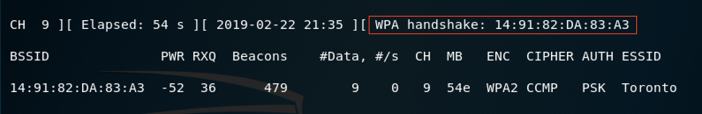

# Raspberry Pi (RPi) Setup for WiFi Village

This document allows you to setup one RPi to connect to the 2.4GHz `Toronto` network. You will then write a script that will keep connecting to and disconnection from the `Toronto` WiFi network in order to generate handshakes that the students can capture and use for cracking the password (with a given [wordlist](./resources/names.txt), of course).

Before you proceed, make sure you labeled this RPi as `Toronto` to avoid future confusions! Once Kali is up and running, perform the following actions in the same order.

### Connect to the target WiFi network

Connect to the `Toronto` WiFi network and enter the correct password.


### Make a script that connects and disconnects from the WiFi network

Now, we want to create a script that will keep connecting to and disconnection from the WiFi network in order to generate handshakes that the students can capture.

Go to ```/root/```

Create a ```script.sh```

run:
```chmod +x script.sh```

Open script.sh and type:

```#!/bin/sh
sleep 60
rm /root/started.txt
echo "Last Run Started on " >> /root/started.txt
echo $(date) >> /root/started.txt
while :
do
	nmcli con up id Toronto
	sleep 80
	echo "Connected to Toronto on" >> /root/started.txt
	echo $(date) >> /root/started.txt 
	nmcli con down id Toronto
	sleep 20
	echo "Disconnected from Toronto on" >> /root/started.txt
	echo $(date) >> /root/started.txt
done
echo "STOP" > /root/STOP.txt
```

Notice that in the above example I'm using ```Toronto``` as my WiFi network ESSID.

### Set Kali to run the script you just made on boot

In the terminal, go to ```/etc/```

Run ```gedit crontab```

At the bottom of the file type:
```@reboot /root/script.sh &```

Save and exit

Run ```sudo crontab -e```

At the bottom of the file type:
```@reboot /root/script.sh &```

### Reboot and test

Now, reboot your `Toronto` RPi.

On your own laptop, run `airodump-ng` on the correct channel and correct essid to scan the `Toronto` WiFi network.

Example: `airodump-ng -c 9 --essid Toronto wlan0mon`

Within 5 minutes you should get a handshake as shown in the following figure:



---

&copy; Ahmed Ibrahim, 2019

This work is licensed under the Creative Commons Attribution-NonCommercial-ShareAlike 4.0 International License (CC BY-NC-SA 4.0). To view a copy of this license, visit https://creativecommons.org/licenses/by-nc-sa/4.0/.

The information contained herein are provided on an "AS IS" basis and THE CONTRIBUTOR, THE ORGANIZATION HE/SHE REPRESENTS OR IS SPONSORED BY (IF ANY) DISCLAIM ALL WARRANTIES, EXPRESS OR IMPLIED, INCLUDING BUT NOT LIMITED TO ANY WARRANTY THAT THE USE OF THE INFORMATION HEREIN WILL NOT INFRINGE ANY RIGHTS OR ANY IMPLIED WARRANTIES OF MERCHANTABILITY OR FITNESS FOR A PARTICULAR PURPOSE.
