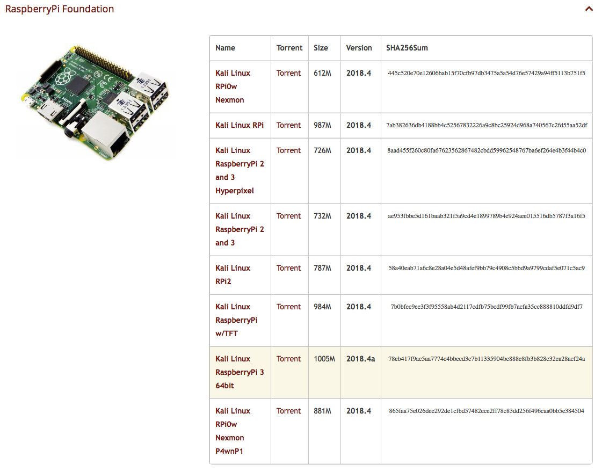
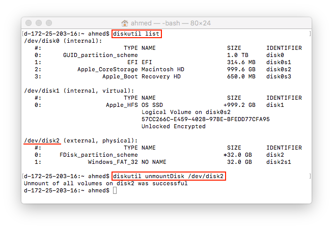
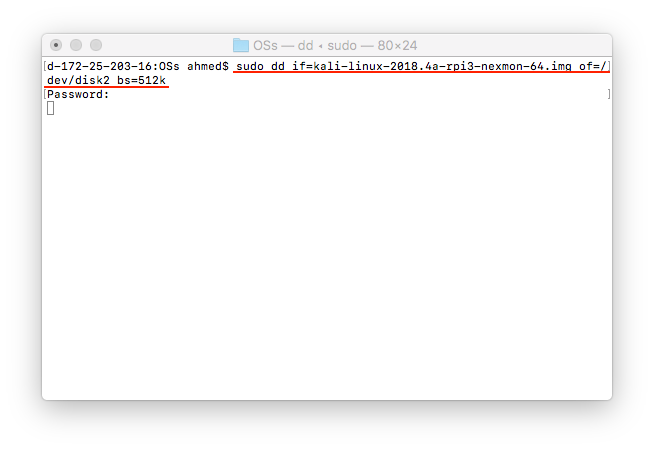
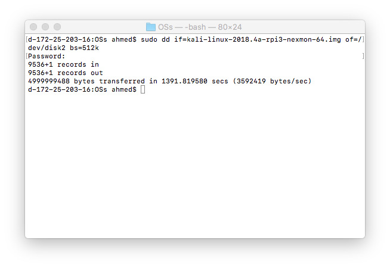

# Raspberry Pi (RPi) Setup for WiFi Village

This document allows you to either:

A- download and use a RPi Kali image we prepared :metal:

or

B- setup your RPi using the step-by-step instructions provided below

If you run into trouble or have questions, feel free to e-mail [Ahmed Ibrahim](aibrahim@pitt.edu) for assistance.

---

## Option A: Download and use a RPi Kali image we prepared

---

1. Download this image: [Kali18-RPi-Mini-WiFi-Village](https://files.mycloud.com/home.php?brand=webfiles&seuuid=11bcf058543e47e45532b75e396fd8eb&name=Kali18-RPi-Mini-WiFi-Village)      [Alternative Link](https://ahmed.s3.us-east-2.amazonaws.com/resources/Kali18-RPi-Mini-WiFi-Village.img)
2. Insert the 32GB MicroSD card into your computer
3. Unmount the MicroSD card
4. Use ```dd``` to clone the image to the MicroSD card

This image should login automatically into the `root` account. The password for the `root` account is `qazwsxedcrfv`. Please change the password and reconfigure the `ssh` keys.

```passwd```

```rm /etc/ssh/ssh_host_*```

```dpkg-reconfigure openssh-server```

```service ssh restart```

---

## Option B: Setup your RPi (step-by-step instructions)

---

### Download and clone the Raspberry Pi Kali Linux

Step 1:

Download a Kali Linux ARM Images for Raspberry Pi from https://www.offensive-security.com/kali-linux-arm-images/

Here's a screenshot of the RPi section on the Kali Linux ARM Images page:


> At the time of creation of this document, the [Kali Linux Raspberry Pi 3 64bit](https://images.offensive-security.com/arm-images/kali-linux-2018.4a-rpi3-nexmon-64.img.xz) which has a size of 1005M, version '2018.4a' and SHA265Sum of '78eb417f9ac5aa7774c4bbecd3c7b11335904bc888e8fb3b828c32ea28acf24a' was used.

Step 2:

Extract the `.xz` file to obtain the `.img` file.

Example: On a mac, type: `xz -d file.img.xz`

Step 3:

Insert the 32GB MicroSD card into your computer. Find the card's path and unmount the MicroSD card.

If you are using a MAC, you will run the following commands:

`diskutil list`

assuming that the MicroSD card is /dev/disk2, you will then unmount it using the follwowing command:

`diskutil unmountDisk /dev/disk2`



Step 4:

Use the `dd` command to clone the Kali image onto the SD card. The process for doing so is described here: https://docs.kali.org/kali-on-arm/install-kali-linux-arm-raspberry-pi .

The command will be something like `sudo dd if=[name of kali image file] of=[path of MicroSD card, found using command “diskutil list” on Mac] bs=512k`

Make sure the kali image is in the current working directory. When you run the command, no output will show in your terminal until the clone is complete. Prepare for this command to run for 15-20 minutes.

Example run:

After running the following command:

`sudo dd if=kali-linux-2018.4a-rpi3-nexmon-64.img of=/dev/disk2 bs=512k`

you will see the screen just looking like this for a long time:



Once the `dd` is completed, the output on the terminal will look like this:



Now, you can unmount the MicroSD card and insert it into your RPi.

### Boot Kali on your RPi and change the default password

Step 1:

Insert the MicroSD card into your RPi. 

Step 2:

Connect the RPi to a monitor.

Step 3:

Connect the power to the RPi. Watch Kali booting :tada:. Login using username `root` and password `toor`.

When you get the "Welcome to the first start of the panel" window, choose "Use default config".

Step 4:

Open up a terminal and use the ```passwd``` command to change the default `root` password. Since this RPi will be connected to a WiFi that will be hacked, make sure to use a secure passphrase. It is highly likely that someone may be inclind to get into this RPi.

> Why is this important ?
> Since this RPi will be connected to a WiFi network that will be hacked, it is highly likely that someone may be inclind to get into this RPi. Thus, make sure to use a secure passphrase.

### Change the SSH host keys

Changing the SSH host keys can be accomplished by doing the following:

```rm /etc/ssh/ssh_host_*```

```dpkg-reconfigure openssh-server```

```service ssh restart```

### Joining a WiFi network for setup

Connect to the Internet by either plugging in a network cable into the RPi's ethernet port or join a Wireless network.

> Note: If you join a wireless network, you should delete it from /etc/NetworkManager/system-connections/ as described in a later section.

### Initial preparation

Run the following commands:

```sudo apt-get update
sudo apt-get install network-manager
sudo apt-get install gedit
sudo apt-get install python3
sudo apt-get install python-pip
pip install scapy
```

### Configure Kali to login automatically on boot

Open a terminal and perform the following steps.

Step 1:

Go to 
`cd /etc/lightdm`

Step 2:

Run
`gedit lightdm.conf`

Step 3:

Uncomment the following 2 lines:

```autologin-user=``` then add ```root``` to the end of the string so that the string is now ```autologin-user=root```

```autologin-user-timeout=0```

> Note that searching for these strings in the file may return the first instance of their usage, a commented section describing all flags and their usage. We want the second (I think) instance (the instance that is meant for actually being used rather than being a commented description of commands).

Step 4:

Save and close the ```lightdm.conf``` file.

Step 5:

Go to 
`cd /etc/pam.d`

Step 6:

Run
`gedit lightdm-autologin`

Step 7:

Under the ```# Allow access without authentication``` section, comment out ```auth	required pam_succeed_if.so user != root quiet_success``` with a pound sign.

Step 8:

Save and close the ```lightdm-autologin``` file.


### Remove the current WiFi network

If you have connected to a WiFi network while performing the *Initial prepartion* section directions, you need to forget that network.

To do so, go to ```/etc/NetworkManager/system-connections/```

and delete any available files using the following command:

```rm *```


---

Acknowledgment: [Michael Benos](mtb9ps@virginia.edu) came up with and documented most of the directions in this document.

&copy; Ahmed Ibrahim, 2019

This work is licensed under the Creative Commons Attribution-NonCommercial-ShareAlike 4.0 International License (CC BY-NC-SA 4.0). To view a copy of this license, visit https://creativecommons.org/licenses/by-nc-sa/4.0/.

The information contained herein are provided on an "AS IS" basis and THE CONTRIBUTOR, THE ORGANIZATION HE/SHE REPRESENTS OR IS SPONSORED BY (IF ANY) DISCLAIM ALL WARRANTIES, EXPRESS OR IMPLIED, INCLUDING BUT NOT LIMITED TO ANY WARRANTY THAT THE USE OF THE INFORMATION HEREIN WILL NOT INFRINGE ANY RIGHTS OR ANY IMPLIED WARRANTIES OF MERCHANTABILITY OR FITNESS FOR A PARTICULAR PURPOSE.
